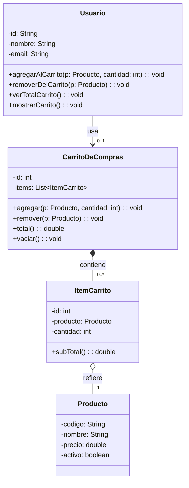
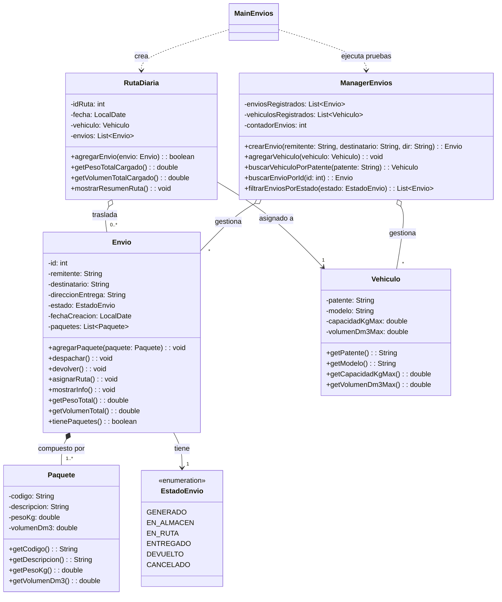

# Programación Orientada a Objetos — Trabajo Práctico Nº 5
**Carrera:** Analista Programador Universitario (APU)  
**Institución:** Facultad de Ingeniería – Universidad Nacional de Jujuy (UNJu)  
**Sede:** Extensión Áulica San Pedro  
**Ciclo Lectivo:** 2026  
**Fecha de Entrega:** 18/09/2026  

---

## 📑 Acceso Rápido
* [Diagrama UML — Punto 1 (Ecommerce)](#ejercicio-1--ecommerce)
* [Diagrama UML — Punto 2 (Logística y Despachos)](#ejercicio-2--logística-y-despachos)
* [Historias de Usuario (Resumen)](#-historias-de-usuario-resumen)
* [Estructura del Proyecto y Código Fuente](#-estructura-del-proyecto)
* [Instrucciones de Ejecución](#-ejecución)

---

## 👥 Integrantes — Grupo 10
* Gustavo Elias Murad — LU: APU002128 — GitHub: [@gustavounju]

---

## 📌 Descripción del Proyecto
Este repositorio contiene la resolución del Trabajo Práctico Nº 5 enfocado en el diseño orientado a objetos, relaciones entre clases (asociación, agregación, composición, dependencia) y el framework de colecciones (Collections / List) en Java.

El desarrollo se compone de dos módulos:
1. **Módulo Ecommerce (Punto 1):** Gestión de carritos de compras, ítems, productos y operaciones asociadas.
2. **Módulo Logística (Punto 2):** Despacho y entrega de envíos compuestos por uno o más paquetes, control estricto de capacidad máxima de peso y volumen en vehículos, ciclos de vida con máquina de estados y diagramación de rutas diarias.

---

## 📊 Diagramas de Clases UML

### Ejercicio 1 — Ecommerce



### Ejercicio 2 — Logística y Despachos



---

## 🛠️ Tecnologías y Herramientas
* **Lenguaje:** Java 17 (o superior)
* **Gestor de dependencias:** Apache Maven
* **Entorno de Desarrollo (IDE):** Eclipse IDE
* **Control de versiones:** Git & GitHub

---

## 📂 Estructura del Proyecto

```text
poo_tp5_grupo10/
├── doc/
│   ├── historioas_de_usuario_punto01.md
│   └── historioas_de_usuario_punto02.md
├── src/
│   ├── main/
│   │   ├── java/
│   │   │   └── ar/edu/unju/fi/poo/
│   │   │       ├── punto01/
│   │   │       │   ├── main/MainEcommerce.java
│   │   │       │   ├── manager/ManagerProducto.java
│   │   │       │   └── model/
│   │   │       │       ├── CarritoDeCompras.java
│   │   │       │       ├── ItemCarrito.java
│   │   │       │       ├── Producto.java
│   │   │       │       └── Usuario.java
│   │   │       └── punto02/
│   │   │           ├── main/MainEnvios.java
│   │   │           ├── manager/ManagerEnvios.java
│   │   │           └── model/
│   │   │               ├── Envio.java
│   │   │               ├── EstadoEnvio.java
│   │   │               ├── Paquete.java
│   │   │               ├── RutaDiaria.java
│   │   │               └── Vehiculo.java
│   │   └── resources/
├── pom.xml
└── README.md
```

---

## 📋 Historias de Usuario (Resumen)

### Ejercicio 1 — Ecommerce
* **HU01 - Agregar al carrito:** Seleccionar productos y cantidades para cargarlos al carrito.
* **HU02 - Remover del carrito:** Quitar productos agregados previamente.
* **HU03 - Cálculo de total:** Visualizar el importe total actualizado según subtotales de cada ítem.
* **HU04 - Vaciar carrito:** Limpiar los artículos del carrito en una sola operación.

### Ejercicio 2 — Logística y Despachos
* **HU01 - Registro de paquetes:** Cargar paquetes con código, descripción, peso (kg) y volumen (dm³).
* **HU02 - Registro de vehículos:** Registrar unidades con patente, modelo y capacidades máximas.
* **HU03 - Creación de envíos:** Registrar envíos con remitente, destinatario, dirección y agregar uno o más paquetes con estado inicial GENERADO.
* **HU04 - Asignación a ruta diaria:** Cargar envíos a la ruta validando presencia de paquetes y topes de peso y volumen del vehículo.
* **HU05 - Ciclo de vida y estados:** Gestionar transiciones de estado (EN_ALMACEN, EN_RUTA, ENTREGADO, DEVUELTO, CANCELADO).

---

## 🚀 Ejecución

1. Clonar el repositorio:
   ```bash
   git clone https://github.com/gustavounju/poo_tp5_grupo10.git
   cd poo_tp5_grupo10
   ```
2. Importar en Eclipse IDE como **Existing Maven Projects**.
3. Ejecutar las clases principales:
   * **Punto 1:** `ar.edu.unju.fi.poo.punto01.main.MainEcommerce`
   * **Punto 2:** `ar.edu.unju.fi.poo.punto02.main.MainEnvios`